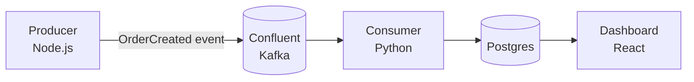
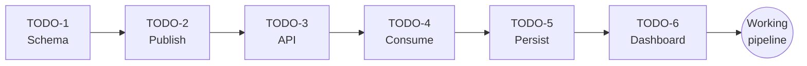
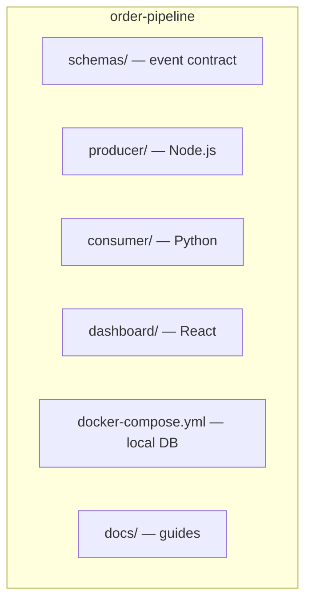
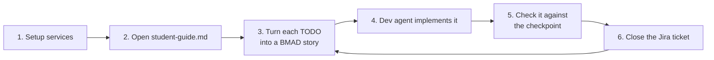
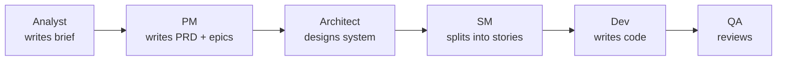

# Order Pipeline

A hands-on training project. You build a small, real event-driven system —
and use BMAD agents to do it — while everything is tracked in Jira and
streamed through Confluent Kafka.

## What this project is doing

An order comes in → gets published as an event → flows through Kafka →
gets saved → shows up live on a dashboard.

Three different stacks, one event contract (the Avro schema), all wired
together by you.

---

## What Unlocks After Each TODO

| TODO | You touch | After it's done |
|---|---|---|
| TODO-1 | Avro schema | Event contract includes order `status` |
| TODO-2 | Producer → Kafka | Producer can publish events to Confluent |
| TODO-3 | Producer API | `POST /orders` creates and publishes an order |
| TODO-4 | Consumer loop | Consumer reads events off the topic |
| TODO-5 | Consumer → DB | Orders are saved to Postgres |
| TODO-6 | Dashboard | Live orders appear in the browser, auto-refreshing |
| TODO-7 | Docker Compose | Postgres reports healthy before consumer starts |

By TODO-6, the full pipeline runs end-to-end: an order posted in a terminal
shows up on the dashboard within seconds.

---

## Table of Contents

1. [Prerequisites](#prerequisites)
2. [Project Structure](#project-structure)
3. [Tech Stack & Usage](#tech-stack--usage)
4. [How to Use This Project](#how-to-use-this-project)
5. [What Unlocks After Each TODO](#what-unlocks-after-each-todo)
6. [Guides](#guides)
7. [What is BMAD](#what-is-bmad)

---

## Prerequisites

- [ ] Node.js 18+
- [ ] Python 3.10+
- [ ] Docker (for local Postgres)
- [ ] Confluent Cloud account + cluster + API key
- [ ] Jira project (with API access or MCP connector)
- [ ] An AI-agent-capable editor (Claude Code, Cursor, etc.) with BMAD installed

---

## Project Structure

---

## Tech Stack & Usage

### Avro Schema (`schemas/`)
- **What it is:** a compact format for describing the structure of data —
  field names, types, defaults — used with Kafka's Schema Registry.
- **What it's for:** the contract for the `OrderCreated` event — every
  service agrees on this shape.
- **You use it:** as the source of truth when writing producer/consumer code.
- **BMAD:** Architect agent designs it first, before any service code.

### Producer — Node.js (`producer/`)
- **What it is:** a JavaScript runtime for running server-side code outside
  the browser. Here it runs Express, a minimal web framework for building
  HTTP APIs.
- **What it's for:** a small Express API. `POST /orders` creates an order
  and publishes it to Kafka.
- **You use it:** `npm run start`, then `curl -X POST localhost:4000/orders`.
- **BMAD:** Dev agent implements the route and the Kafka client
  (`kafkajs`), guided by the story from SM.

### Confluent Kafka (managed cloud)
- **What it is:** a managed version of Apache Kafka, a distributed
  event-streaming platform. Producers write events to "topics"; consumers
  read them independently, at their own pace.
- **What it's for:** the event bus — decouples the producer from the
  consumer, buffers events, guarantees order per key.
- **You use it:** watch messages arrive in the Confluent Cloud UI as you
  POST orders.
- **BMAD:** Architect agent decides topic name/partitioning; Dev agent
  wires the connection.

### Consumer — Python (`consumer/`)
- **What it is:** a general-purpose scripting language, widely used for
  data and backend services. Here it uses `confluent-kafka` (a Kafka
  client library) and `psycopg2` (a Postgres driver).
- **What it's for:** reads events off `orders.created` and saves them.
- **You use it:** `python consumer.py`, running continuously in a terminal.
- **BMAD:** Dev agent implements the poll loop and the DB insert as two
  separate stories (TODO-4, TODO-5).

### Postgres (via Docker)
- **What it is:** an open-source relational database — stores structured
  rows in tables, queried with SQL. Docker packages it into a container so
  it runs the same on any machine without a manual install.
- **What it's for:** durable storage for orders, so the dashboard has
  something to read.
- **You use it:** `docker compose up -d`, then query with `psql`.
- **BMAD:** Architect agent decides the schema; runs locally via
  `docker-compose.yml`.

### Dashboard — React (`dashboard/`)
- **What it is:** a JavaScript library for building user interfaces out of
  reusable components. Vite is the tool used here to run and bundle it.
- **What it's for:** shows live order status, polling every 3 seconds.
- **You use it:** `npm run dev`, open `localhost:5173`.
- **BMAD:** Dev agent implements the fetch/polling logic (TODO-6).

### Jira
- **What it is:** an issue-tracking tool — organizes work into epics,
  stories, and tickets that move across a board as they're worked on.
- **What it's for:** the system of record — epics from PM, stories from
  SM, status updates from Dev/QA.
- **You use it:** track your TODO progress as tickets moving across the
  board.
- **BMAD:** every agent in the chain reads or writes here instead of a
  local-only doc.

---

## How to Use This Project

**Steps:**
1. `docker compose up -d` — starts Postgres
2. `producer/` and `consumer/` — copy `.env.example` → `.env`, fill in Confluent credentials
3. Install dependencies in each service (`npm install` / `pip install -r requirements.txt`)
4. Work through `docs/student-guide.md`, one TODO at a time
5. Use `docs/trainer-guide.md` if you get stuck or want to see the reasoning behind a step

---

## What is BMAD

BMAD-METHOD is a set of AI agents (Analyst, PM, Architect, SM, Dev, QA) that
turn an idea into working code through documented steps, not one big prompt.

In this project, every TODO is one story. You (or the trainer) hand it to
the SM agent, the Dev agent implements it, and the ticket moves in Jira.
BMAD isn't a separate tool bolted on — it's how each piece below gets built.

---

## Guides

- **`docs/student-guide.md`** — your TODO checklist, checkpoints, stretch goals
- **`docs/trainer-guide.md`** — why each step matters, what to observe, full solutions
